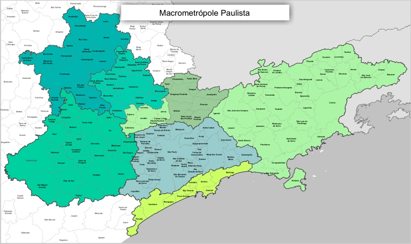

<style>
.remark-slide-number {
  position: inherit;
}

.remark-slide-number .progress-bar-container {
  position: absolute;
  bottom: 0;
  height: 4px;
  display: block;
  left: 0;
  right: 0;
}

.remark-slide-number .progress-bar {
  height: 100%;
  background-color: red;
}
</style>
```{r setup, include=FALSE}
knitr::opts_chunk$set(echo = TRUE)
```

# Sobre mim
.left-column[

]
.right-column[
- Beatriz Milz, 25 anos, Diadema.
- Bacharel em Gestão Ambiental (EACH/USP);
- Mestre em Ciências no PPG-Análise Ambiental Integrada (UNIFESP/Diadema)
- Atualmente candidata ao Doutorado em Ciência Ambiental no PROCAM/IEE/USP.
- Aprendendo R desde agosto de 2018.
- Participa da comunidade R-Ladies São Paulo desde agosto de 2018.

- Email:<a href="mailto:beatriz.milz@hotmail.com"><i class="fas fa-envelope-square"></i>&nbsp; beatriz.milz@hotmail.com</a><br>

- Github:<a href="http://github.com/beatrizmilz"><i class="fab fa-github"></i>&nbsp; @beatrizmilz</a> (repositório de código)<br>
]


---


#Macrometrópole Paulista

Projeto Temático Fapesp: Governança ambiental da macrometrópole paulista face à variabilidade climática<br>
<center>

</center>
---
#Delimitação territorial da Macrometrópole Paulista (MMP)
* Diferentes delimitações:
+ [Empresa Paulista de Planejamento Metropolitano](https://www.emplasa.sp.gov.br/MMP) 
(EMPLASA): 174 municípios
+ [Departamento de Águas e Energia Elétrica](http://www.daee.sp.gov.br) 
(DAEE): 180 municípios

---
class: center, middle
background-image: url("imagens/logo_MA_color.png")
background-size: contain, 50% 50%, cover

# É um desafio!


---
#Como o R pode ajudar?

> R is a free software environment for statistical computing and graphics. (https://www.r-project.org/)

> R é um ambiente de software livre para computação estatística e gráficos.


* O R é open-source
<br>
<center></center>

---
# O R é uma linguagem de programação.

Qual é a vantagem?
### É um texto
### É reprodutível 
### Dá para compartilhar!

---
Exemplo:
```{r}
attach(mtcars)
plot(wt, mpg, main="Scatterplot Example",
xlab="Car Weight ", ylab="Miles Per Gallon ", pch=19) 


```


---
## Rmarkdown
* É um tipo de arquivo que suporta códigos em R, texto, markdown e outros formatos.
* O markdown é uma linguagem de marcação simples. 

* [Rmarkdown Cheatsheet](http://www.rstudio.com/wp-content/uploads/2016/03/rmarkdown-cheatsheet-2.0.pdf)
* Possibilita exportar diferentes tipos de arquivos.
<br>
<center></center>

---
#Rmarkdown

É possível elaborar relatórios no Rmarkdown.
Porque é interessante?

##Exemplo:

Pergunta: Qual é a população da MMP?
* Depende da delimitação territorial!
* Neste exemplo usaremos a delimitação da EMPLASA.

---
#Tidyverse
Primeiro precisamos carregar o pacote tidyverse.
```{r echo=TRUE, message=FALSE, warning=FALSE}
#install.packages("tidyverse") # Instalar o pacote Tidyverse

library(tidyverse) #Carregar o pacote tidyverse
```

<center>

</center>


Fonte: http://r4ds.had.co.nz/
---
# Quais são as divisões administrativas?
## Importar a tabela para o R:

obs: Agradeço à Nana Laura e Ana Lia pela elaboração e disponibilização da tabela que contém a divisão administrativa, e os municípios pertencentes à MMP. 
```{r message=FALSE, warning=FALSE}
#Carregar a tabela de divisão administrativa
divisao_adm <- readxl::read_xlsx("dados/divisao_adm.xlsx")
#Renomear as colunas
names(divisao_adm) <- c("codigo_ibge", "municipio", "regiao_administrativa", "regiao_de_governo", "regiao_metropolitana", "aglomeracoes_urbanas", "rm_au")
#Transformar a coluna do código IBGE em número
divisao_adm$codigo_ibge <- as.integer(divisao_adm$codigo_ibge) 

```
---

# Delimitação Emplasa

- Importar as tabelas excel contendo os municípios que fazem parte da MMP:
```{r}
# Importar a tabela para o R
mmp_emplasa <- readxl::read_xlsx("dados/delimitacaoterritorialMMP_Emplasa.xlsx")

# Renomear as colunas para padronizar os nomes
names(mmp_emplasa) <- c("municipio","codigo_ibge")

# Padronizar e deixar o código do IBGE configurado como número 
mmp_emplasa$codigo_ibge <- as.integer(mmp_emplasa$codigo_ibge) 

#Juntar os dados de divisão administrativa baseados nos municípios contidos na tabela da Emplasa
mmp_emplasa <- left_join(mmp_emplasa, divisao_adm, by="codigo_ibge") 

# Deletar a coluna que fica repetida
mmp_emplasa$municipio.y <- NULL

```


---
class:  center, middle

# E agora?

##Podemos cruzar com outros bancos de dados!
---
#Cruzar com outras informações

Para esse exemplo, vamos cruzar com dados de população por município:
- Informações dos Municípios Paulistas - 
http://www.imp.seade.gov.br/frontend/


```{r echo=TRUE, message=FALSE, warning=FALSE}
# Importar a tabela para o R
imp_2018 <- read_csv2("dados/imp_2018-10-02_01-05.csv")
#Renomear as colunas
names(imp_2018) <- c("municipio", "ano", "populacao", "populacao_masculina", "populacao_feminina", "razao_de_sexos", "populacao_urbana", "populacao_rural", "grau_urbanizacao_porcentagem", "codigo_ibge")

```
---

#Left Join - Emplasa
```{r}
# Cria a tabela e faz o left join baseado no código IBGE
imp_2018_mmp_emplasa <- left_join(mmp_emplasa, imp_2018, by="codigo_ibge")
# A coluna de município está repetida, então apago uma delas. 
imp_2018_mmp_emplasa$municipio.y <- NULL

head(imp_2018_mmp_emplasa)
```

---
class: inverse, center, middle

# Vamos aos dados!


---
# População na MMP entre 2014 e 2018 - Delimitação EMPLASA 
Fonte: - Informações dos Municípios Paulistas - 
http://www.imp.seade.gov.br/frontend/
```{r}
imp_2018_mmp_emplasa %>% 
group_by(ano) %>%
  summarise(PopulacaoTotal = sum(populacao))
```
Segundo os dados da SEADE, em 2018 a MMP tem  32,88 milhões de habitantes.

---
População na MMP em 2018, por RM/AU, segundo os dados da SEADE:
```{r echo=FALSE, warning=FALSE}
imp_2018_mmp_emplasa %>% 
  mutate(populacao = populacao/1000000) %>%  #transformar em milhões
  filter(ano =="2018") %>% 
  group_by(rm_au) %>% summarise(PopulacaoTotal = sum(populacao)) %>% 
arrange (desc(PopulacaoTotal)) %>%
  ggplot()+
  geom_col(aes(x = reorder( rm_au ,-PopulacaoTotal), y = PopulacaoTotal, fill=rm_au))+
   labs(
  x = "Região Metropolitana/Aglomeração Urbana", 
  y = "População",
  fill = "Região Metropolitana/Aglomeração Urbana"
)+
 theme(axis.title.x=element_blank(),
        axis.text.x=element_blank(),
        axis.ticks.x=element_blank())
```

---
# Vantagens de trabalhar com o R e o Rmarkdown

* É possível escrever os códigos que geram as tabelas e gráficos.


* Quando o banco de dados for atualizado (por exemplo, houver alguma modificação na lista de municípios pertencentes à MMP) não será necessário refazer os gráficos. Apenas necessário compilar novamente.


* Facilita o compartilhamento dos dados e análises com outros pesquisadores.


* É possível exportar em diversos formatos, inclusive transformar o relatório em apresentações. 


---
# Materiais de estudo


- [R for Data Science](https://r4ds.had.co.nz/) - Livro em inglês, disponibilizado gratuitamente online. Conteúdo muito bom sobre R.

- [Curso-R](http://curso-r.com/) - Cursos presenciais sobre R.

- [Material Curso-R](http://material.curso-r.com/) - Material disponibilizado pela Curso-R para estudo.

- [Blog Curso-R](https://www.curso-r.com/blog/) - Blog do Curso-R com diversos conteúdos interessantes.


# Links interessantes
* [Dados de execução orçamentária da PMSP](https://beatrizmilz.github.io/DadosExecucaoOrcamentariaPMSP/index.html)

* [Rpollution](https://www.rpollution.com/) - Blog onde é publicado análise de dados sobre poluição do ar;
---
class: inverse, center, middle


# Obrigada!
Apresentação elaborada com [Xaringan](https://github.com/yihui/xaringan)


